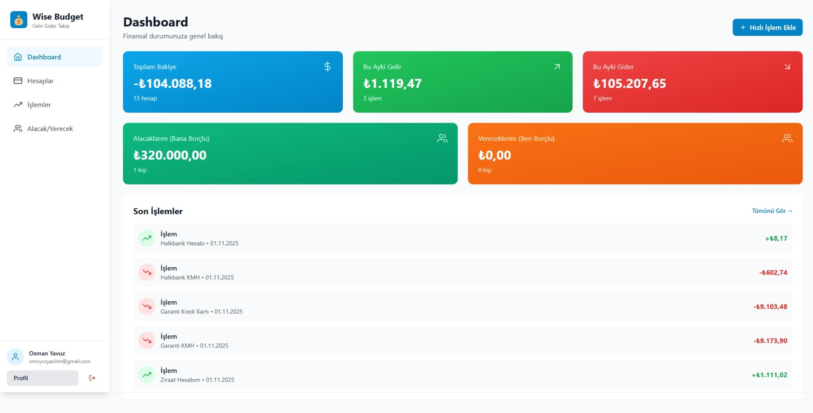
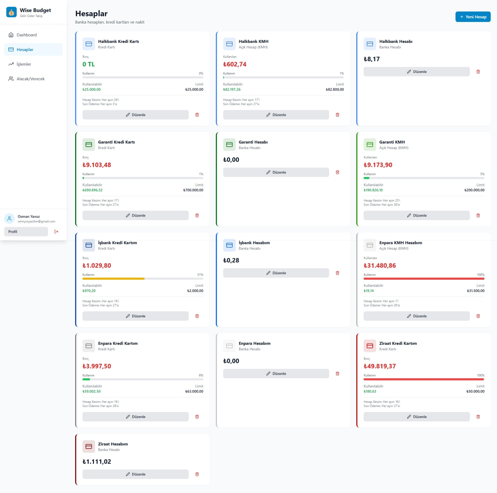
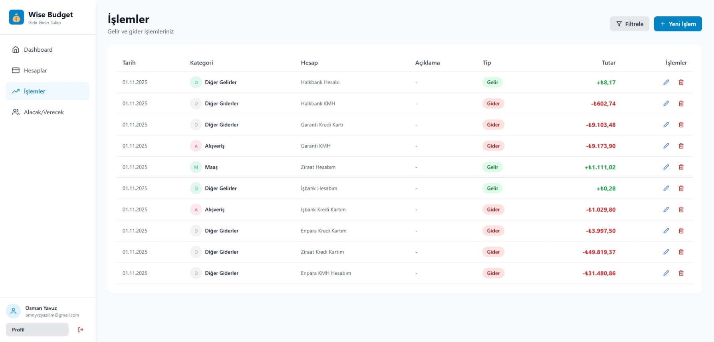
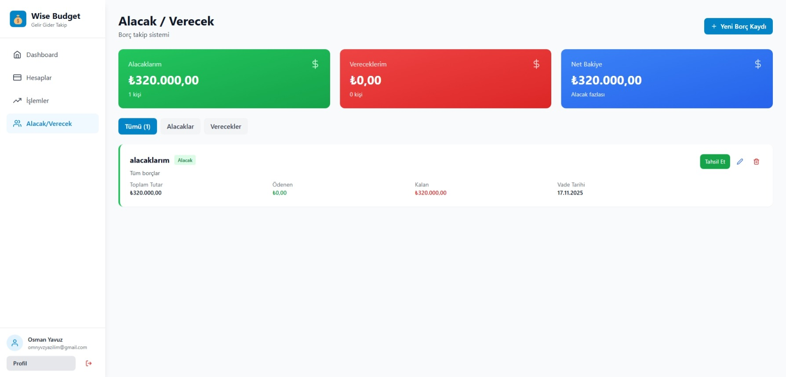
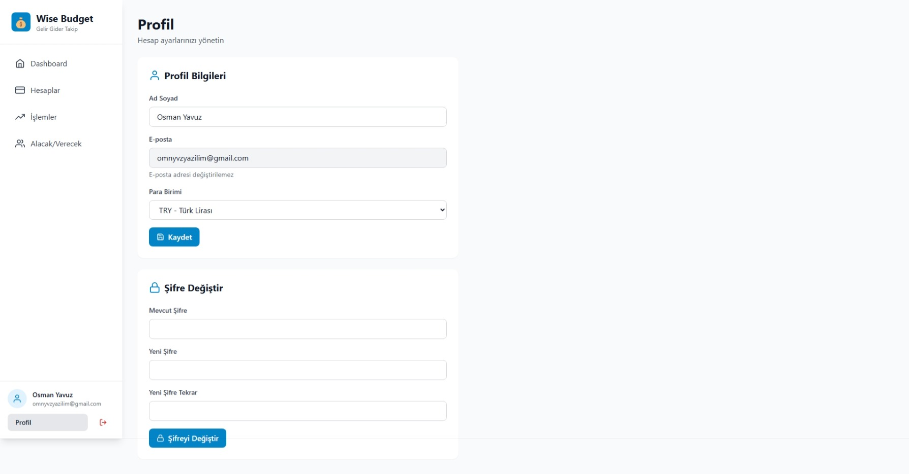

# 💰 Wise Budget - Kişisel Finans Yönetim Uygulaması

[](https://reactjs.org/)
[](https://nodejs.org/)
[](https://www.mysql.com/)
[](https://tailwindcss.com/)
[](LICENSE)

Modern ve kullanıcı dostu bir gelir-gider takip uygulaması. Hesaplarınızı, işlemlerinizi, borçlarınızı ve alacaklarınızı kolayca yönetin.

> 🎯 **Özellikler:** Çoklu hesap yönetimi • Kredi kartı takibi • Alacak/Verecek sistemi • Gelişmiş filtreleme • Responsive tasarım

## 📑 İçindekiler

- [📸 Ekran Görüntüleri](#-ekran-görüntüleri)
- [🚀 Özellikler](#-özellikler)
- [🛠️ Teknolojiler](#️-teknolojiler)
- [📦 Kurulum](#-kurulum)
- [🎯 Kullanım](#-kullanım)
- [📁 Proje Yapısı](#-proje-yapısı)
- [🔐 Güvenlik](#-güvenlik)
- [🎨 Öne Çıkan Özellikler](#-öne-çıkan-özellikler)
- [👨‍💻 Geliştirici](#-geliştirici)
- [📞 İletişim](#-i̇letişim)

## 📸 Ekran Görüntüleri

### Dashboard - Ana Sayfa

*Finansal durumunuza genel bakış: Toplam bakiye, aylık gelir/gider, alacak/verecek özeti ve son işlemler*

### Hesaplar

*Tüm hesaplarınız: Banka hesapları, kredi kartları, nakit ve açık hesaplar (KMH) - Limit takibi ve kullanım yüzdeleri*

### İşlemler

*Gelir ve gider işlemleriniz: Kategori bazlı takip, gelişmiş filtreleme ve hızlı işlem ekleme*

### Alacak/Verecek

*Borç takip sistemi: Kişi bazlı alacak ve verecek yönetimi, vade takibi ve kısmi ödeme desteği*

### Profil

*Hesap ayarları: Profil bilgileri, şifre değiştirme ve para birimi tercihleri*

## 🚀 Özellikler

### 💳 Hesap Yönetimi
- Çoklu hesap desteği (Banka, Kredi Kartı, Nakit, Yatırım, Açık Hesap)
- Kredi kartı limit takibi ve borç yönetimi
- Açık hesap (KMH) limit takibi
- Hesap sahibi/kart sahibi bilgisi
- Renkli hesap etiketleri

### 📊 İşlem Takibi
- Gelir, gider ve transfer işlemleri
- Kategori bazlı işlem yönetimi
- Gelişmiş filtreleme (tarih, tutar, kategori, hesap)
- Hızlı işlem ekleme
- İşlem düzenleme ve silme

### 👥 Alacak/Verecek Yönetimi
- Kişi bazlı borç takibi
- Alacak (bana borçlu) ve verecek (ben borçlu) ayrımı
- Vade tarihi takibi ve uyarıları
- Kısmi ödeme desteği
- Ödeme geçmişi

### 📈 Dashboard ve Raporlama
- Toplam bakiye özeti
- Aylık gelir/gider özeti
- Borç/alacak özeti
- Son işlemler listesi
- Minimal ve temiz arayüz

### 🎨 Kullanıcı Deneyimi
- Modern ve responsive tasarım
- Koyu/açık tema desteği
- Mobil uyumlu
- Türkçe dil desteği
- Toast bildirimleri

## 🛠️ Teknolojiler

### Backend
- **Node.js** - Runtime environment
- **Express.js** - Web framework
- **MySQL** - Veritabanı
- **Sequelize** - ORM
- **JWT** - Authentication
- **bcrypt** - Password hashing

### Frontend
- **React** 18.3 - UI library
- **Vite** 5.4 - Build tool & dev server
- **Tailwind CSS** 3.4 - Utility-first CSS framework
- **React Router DOM** 6.26 - Client-side routing
- **Zustand** 5.0 - State management
- **Axios** 1.7 - HTTP client
- **React Hot Toast** 2.4 - Toast notifications
- **React Icons** 5.3 - Icon library
- **React Currency Input Field** 3.8 - Formatlanmış para girişi

## 📦 Kurulum

### Gereksinimler
- Node.js (v16 veya üzeri)
- MySQL (v8 veya üzeri)
- npm veya yarn

### 1. Projeyi Klonlayın
```bash
git clone https://github.com/OsmanYavuz-web/WiseBudgetApp.git
cd wise-budget-app
```

### 2. Backend Kurulumu
```bash
cd server
npm install
```

`.env` dosyası oluşturun:
```env
PORT=5000
NODE_ENV=development

DB_HOST=localhost
DB_USER=root
DB_PASSWORD=your_password
DB_NAME=wise_budget
DB_PORT=3306

JWT_SECRET=your_super_secret_jwt_key_here_change_this_in_production
JWT_EXPIRE=30d
```

MySQL'de veritabanını manuel olarak oluşturun:
```sql
CREATE DATABASE wise_budget CHARACTER SET utf8mb4 COLLATE utf8mb4_unicode_ci;
```

Varsayılan kategorileri ekleyin:
```bash
npm run seed
```

Backend'i başlatın:
```bash
npm run dev
```

### 3. Frontend Kurulumu
```bash
cd frontend
npm install
```

`.env` dosyası oluşturun (opsiyonel):
```env
VITE_API_URL=http://localhost:5000/api
```

Frontend'i başlatın:
```bash
npm run dev
```

## 🎯 Kullanım

1. **Kayıt Olun**: İlk kullanımda bir hesap oluşturun
2. **Hesap Ekleyin**: Banka hesaplarınızı, kredi kartlarınızı ekleyin
3. **İşlem Girin**: Gelir ve giderlerinizi kaydedin
4. **Borç Takibi**: Alacak ve vereceklerinizi yönetin
5. **Raporları İnceleyin**: Dashboard'dan finansal durumunuzu görüntüleyin

## 📁 Proje Yapısı

```
wise-budget-app/
├── server/                 # Backend (Node.js + Express)
│   ├── config/            # Veritabanı yapılandırması
│   ├── controllers/       # İş mantığı
│   ├── middleware/        # Middleware'ler
│   ├── models/            # Sequelize modelleri
│   ├── routes/            # API route'ları
│   ├── scripts/           # Yardımcı scriptler
│   └── server.js          # Ana sunucu dosyası
│
├── frontend/              # Frontend (React + Vite)
│   ├── public/           # Statik dosyalar
│   └── src/
│       ├── components/   # React bileşenleri
│       ├── lib/          # Yardımcı kütüphaneler
│       ├── pages/        # Sayfa bileşenleri
│       ├── store/        # Zustand store
│       ├── utils/        # Yardımcı fonksiyonlar
│       └── App.jsx       # Ana uygulama
│
└── README.md             # Bu dosya
```

## 🔐 Güvenlik

- JWT tabanlı kimlik doğrulama
- Bcrypt ile şifrelenmiş parolalar
- Protected API route'ları
- Input validasyonu
- SQL injection koruması (Sequelize ORM)

## 👨‍💻 Geliştirici

Developed with ❤️ by Osman Yavuz

## 📞 İletişim

- Email: omnyvz.yazilim@gmail.com
- GitHub: [@OsmanYavuz-web](https://github.com/OsmanYavuz-web)

## 🎨 Öne Çıkan Özellikler

### 💰 CurrencyInput Component
Projede para girişleri için özel geliştirilmiş, formatlanmış input component'i:
- ✅ Otomatik formatlama (1.234,56)
- ✅ Binlik ve ondalık ayırıcılar
- ✅ Türk Lirası (₺) desteği
- ✅ Farklı para birimleri ($, €, £)
- ✅ Negatif değer desteği
- ✅ Hata gösterimi

### 🎯 Kredi Kartı Yönetimi
- Kredi kartı limiti takibi
- Kullanım yüzdesi gösterimi
- Hesap kesim ve ödeme günü takibi
- Borç durumu görselleştirme
- Kullanılabilir limit hesaplama

### 📊 Açık Hesap (KMH) Sistemi
- KMH limit yönetimi
- Kullanım takibi
- Vade ve ödeme günü bildirimleri
- Borç/alacak durumu

### 🔍 Gelişmiş Filtreleme
- Tarih aralığı filtreleme
- Tutar aralığı filtreleme
- Kategori ve hesap bazlı filtreleme
- Arama özelliği
- Hızlı tarih seçimleri (Bugün, Son 7 gün, Bu ay, Geçen ay)

### 📱 Responsive Tasarım
- Mobil uyumlu arayüz
- Tablet desteği
- Desktop optimize
- Modern ve temiz UI/UX